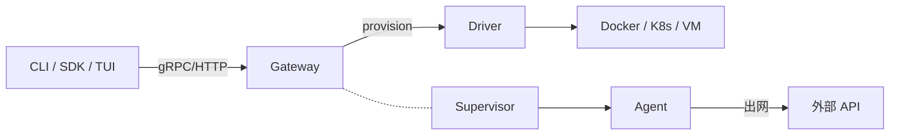
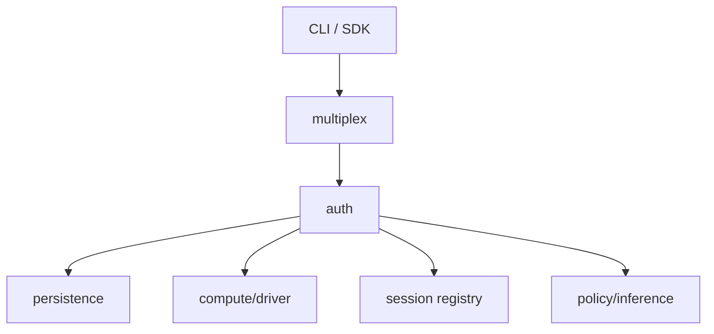
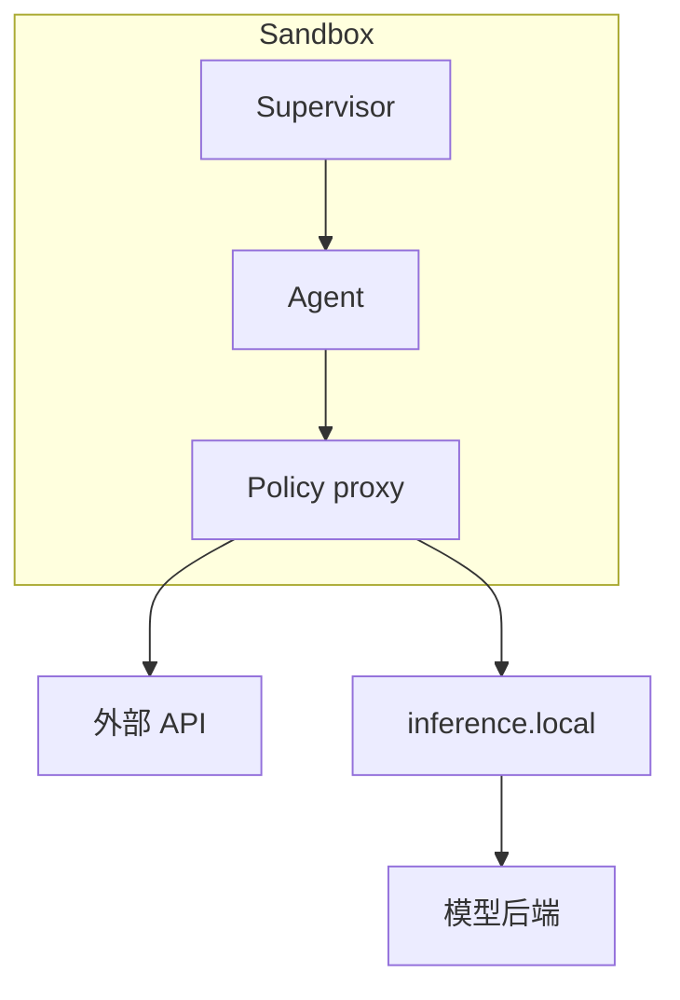
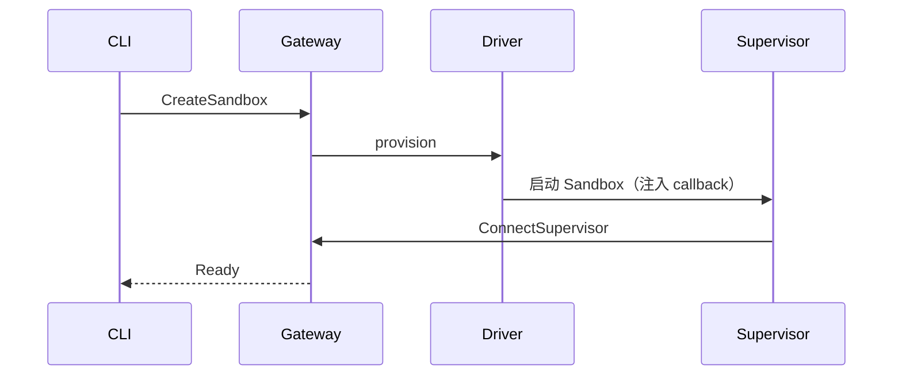
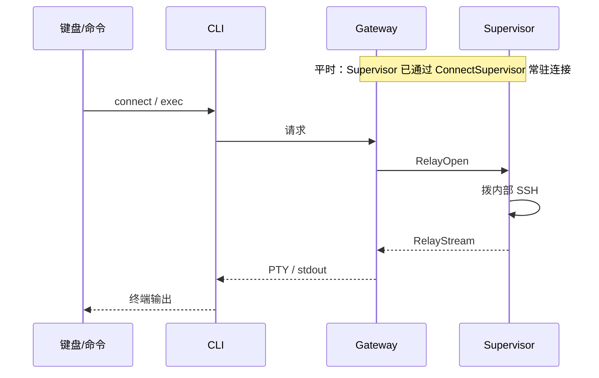
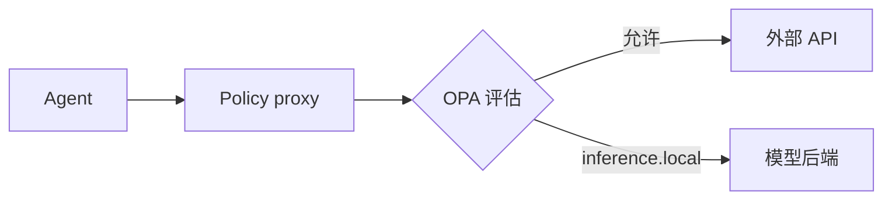

OpenShell 是给自主 Agent（Claude Code、Codex、OpenCode 这类可以执行命令的 agent binary）提供的**带策略的执行环境**。这类 agent binary 一旦能跑命令，理论上就能读本机任意文件、任意出网。OpenShell 的作用是把它们放进沙盒，用声明式 YAML 限制文件系统、进程权限和出站目标，把 Agent 的活动范围收在用户划定的边界内，防止它读到敏感数据、或者对宿主系统造成破坏。

用法是 `sandbox create -- <命令>`，这条命令就成了 Supervisor 的受限子进程。运行时是三层：**CLI/SDK/TUI** 只和 **Gateway** 说话，每个沙盒里再跑一份 **Supervisor**，做本地隔离和出站策略。这套控制面（CLI ↔ Gateway ↔ Supervisor）跟沙盒具体怎么起来是分开的：本机用 Docker，远程用 Kubernetes，还有 Podman、VM，对 Gateway 来说都只是背后一个可插拔的 **Compute Driver**，只管底层怎么起容器/Pod，不参与控制面逻辑。

## 1. 总览

OpenShell 的角色和连接关系：

| 名字 | 在哪 | 是什么 |
|------|------|--------|
| CLI / SDK / TUI | 本机 | 唯一用户入口。创建沙盒、改策略、`connect` / `exec`。不知道底下是 Docker 还是 K8s |
| Gateway | 本机进程或集群 Service | 控制面：鉴权、状态、生命周期、配置下发、把终端字节转进沙盒 |
| Sandbox | 一个容器 / Pod / VM | 一次数据面 workload |
| Supervisor | **Sandbox 里面**的入口进程 | 本地安全边界：隔离、出站代理、回连 Gateway、拉起 Agent |
| Agent | Supervisor 的子进程 | Claude Code / Codex / OpenCode 等 |
| Driver | Gateway 旁边 | 把「起停一个沙盒」翻译成 Docker/K8s/VM，并回报 backend 状态与平台事件；不负责策略 enforcement |

图中 Gateway 和 Supervisor 之间的虚线是**outbound session**：Supervisor 启动后主动 `ConnectSupervisor` 连上 Gateway，一直挂着，走配置、日志，以及"再开一条终端管道"这类信令。不是 Agent 出网的流量，也不是命令的 stdout 本身。

图上有两条互不相干的流量，不要混为一谈：

| | 例子 | 路径 |
|--|------|------|
| 人操作沙盒 | `connect`、`exec -- ls`、创建 | CLI → Gateway → Supervisor；默认不直接暴露 Pod/SSH，集群管理员仍可能通过 `kubectl exec` 等平台权限访问 |
| Agent 自己出网 | 调模型、访问 GitHub | Agent → 沙盒内 proxy → 目标站点。不经 Gateway，也不经 CLI |

职责划分：Gateway 拥有对象和授权（谁能做什么），Supervisor 拥有进程/文件/网络层面的实际 enforcement，Driver 只负责把「起停一个沙盒」翻译成具体平台的 API。静态隔离（Landlock、降权、seccomp、netns）在沙盒创建时钉死，要改只能重建沙盒；网络策略、凭证、推理路由可以在已有会话上热更新。会话断了，Agent 还能继续跑，只是 `connect` 和热更新会失败。

## 2. Gateway：控制面

Gateway 是二进制 `openshell-gateway`（对应 crate `openshell-server`）。CLI 和所有 Supervisor 都只连它，不会直连底层容器或 Pod。

做：鉴权、持久化、让 Driver 起停 workload、下发策略/凭证/推理路由、把 CLI 的终端字节转发到对应 session。不做：拦截 Agent 出网、跑 Landlock，那是 Supervisor 的工作；Gateway 本身看不见沙盒里的进程身份和 socket。

### 2.1 内部模块

一个端口先做 multiplex，拆出 gRPC API 和 HTTP 隧道；鉴权层区分用户身份（mTLS/OIDC）和沙盒身份（JWT），二者不能互换；再往后分别落到持久化、compute+driver、session registry、policy/inference 几块，最终经拦截器交给 handler。下图是这条用户请求链路：

Supervisor 不在这条链路上：它通过 `ConnectSupervisor` / `RelayStream` 单独接入 session registry，没有画在图里。

| 模块 | 职责 |
|------|------|
| `multiplex` / `gateway_listener` | 一端口拆 gRPC 与 HTTP；Docker/Podman 可再开仅 sandbox RPC 的 callback 口 |
| `auth` | 用户 vs `Principal::Sandbox`；`rpc_auth` 决定哪些 RPC 能出现在 callback 口 |
| `persistence` | protobuf 对象库 |
| `compute` | 生命周期；合成公开 `SandboxPhase` |
| `credentials` / `provider_*` | 逻辑 Provider → Secret 后端 |
| `policy_store` / `inference` | 策略 revision、模型路由 bundle |
| `supervisor_session` | 进程内 session 表 + pending relay |
| `grpc/*` | sandbox / provider / policy / workspace RPC |
| `ws_tunnel` / `ssh_sessions` | 隧道与 SSH session 元数据 |
| interceptors | 认证后、handler 前的 unary 拦截（allowlist；secret 字段从拦截载荷剥掉） |

### 2.2 两种身份

在启用 loopback listener 的部署中，一个端口同时跑 gRPC 和 HTTP（health、WebSocket 隧道）。loopback 明文 HTTP 只给沙盒服务子域，不承载 Gateway API；这不是所有远程部署的通用入口。

| 调用方 | 怎么进 | 能调什么 |
|--------|--------|----------|
| CLI / SDK / TUI | 本地默认 mTLS；K8s 用 OIDC 或接入代理 | 沙盒 CRUD、策略、Provider、watch |
| Supervisor | 沙盒 JWT | 仅 allowlist：`ConnectSupervisor`、`RelayStream`、续期、config sync、日志、策略状态 |

K8s 上，Supervisor 不用 mTLS 证明身份：用 projected SA token 调 `IssueSandboxToken`，Gateway 做 `TokenReview` 并核对 Pod / Sandbox 的 ownerReference 后签发 JWT。本机 Docker/Podman/VM 由 runtime 把初始 token 注入进程；这个 JWT 默认 `ttl_secs = 0`（不过期），共享集群应设正 TTL。

`Health` 接口不鉴权，CLI 用 `GetGatewayInfo` 来判断用户是否已登录：返回 `Unauthenticated` 说明凭证被拒，返回 `PermissionDenied` 则说明身份验证过了，只是没有 admin 权限。

### 2.3 持久化

Gateway 里的对象统一存成 protobuf payload 加一组索引列（核心字段是 id、type、name、scope、version、status、resource_version、labels；策略相关的对象还可能用到 dedup_key、hit_count）。sandbox、provider、policy revision、SSH session、inference route 共用同一个 Store：SQLite 是单人默认选项，Postgres 用于外置库场景，生产写入统一走 CAS（compare-and-swap）避免并发覆盖。Secret 单独走凭证后端；如果没有配置外部后端，Gateway 会把它加密后存进库里。

### 2.4 Ready 是怎么合成的

Driver 对 Ready 只负责报告 backend 层面的事实：容器或 Pod 是否在跑，顺带上报生命周期和平台事件。对外的 Ready 状态是 Gateway 合成的：backend 健康且 supervisor session 已注册才算 Ready。backend Ready 但 session 未到 → Provisioning（`SupervisorNotConnected`）；session 已到、backend 快照仍滞后 → 仍算 Ready。

`Stop` 只关掉 exec/SSH，资源和磁盘都保留；`Start` 必须等到一个**新的** session 建立起来才算完成。`SupervisorSessionRegistry` 只在 Gateway 进程内存里，不落库，所以多副本部署会把 Ready 状态打乱（上游 issue #1868）；可靠的 Ready 合成实际上要求单副本。

未认领 relay 的数量上限、超时时间、心跳间隔是实现细节，会随版本变化，以对应版本的 Gateway 配置和源码为准，不是稳定的 API 契约。

## 3. Supervisor：沙盒里的安全边界

`openshell-sandbox` 跑在每一个 Sandbox 里面，是该容器/Pod/VM 的入口进程，不是 Gateway 旁边的服务。

Supervisor 以 root 身份跑，做隔离、出站代理、加载配置和凭证、回连 Gateway；它拉起的 Agent（Claude Code / Codex 等）是非特权进程。Linux 上 spawn Agent 时 fail-closed 清空 capability bounding set，清不空就不启动。

启动顺序是固定的：runtime 注入身份与 callback → 加载策略 → 依次挂上 Landlock / 降权 / netns / proxy / 内部 SSH → `ConnectSupervisor` 回连 Gateway → 最后才 exec Agent。Driver 注入的环境变量会覆盖镜像里的同名变量，防止镜像伪造 callback 地址。

| Crate | 职责 |
|-------|------|
| `openshell-sandbox` | 编排、OCSF、denial 聚合 |
| `openshell-supervisor-process` | 降权、seccomp、netns、SSH、session 客户端、日志推送 |
| `openshell-supervisor-network` | 出站代理、OPA、L7、推理拦截、SigV4 |
| `openshell-supervisor-middleware` | L7 通过后、注凭证前的 HTTP 链 |

隔离是好几层叠加在一起，不是单一原语：

| 层 | 作用 |
|----|------|
| Landlock | 限制文件路径 |
| 进程降权 | 权限最小化 |
| seccomp | 堵住 raw socket 等系统调用 |
| netns | 出站只能进本机 proxy，绕不过去 |
| policy proxy | 校验目标、二进制身份、SSRF、L7 规则 |

L7 这一层可以对 REST 的 method/path、WebSocket 文本消息、GraphQL 操作，以及 MCP/JSON-RPC 的请求方法（含部分请求体字段）执行策略；但目前 JSON-RPC 的 response 和 MCP server-to-client 的 SSE 消息还不会被完整解析。`https://inference.local` 这个地址会绕过普通的 OPA 网络规则，但仍然要经过本地 TLS、请求识别、凭证剥离和 router；如果 Agent 直连外部模型 URL 而不走 `inference.local`，走的还是普通出站策略。

Agent 调用被策略允许的 API 时，明文密钥不需要进入子进程：凭证存在 Gateway，Supervisor 在运行时拉取，HTTP 请求上先用 `openshell:resolve:env:…` 这样的占位符代替真实值，等 proxy 确认目标和 L7 规则都通过之后，才把占位符换成真实的 Header 或 Query 参数。这只是调用路径上的一层附带控制，不是沙盒存在的理由。Agent 的进程环境里只会出现策略和 provider 配置明确允许的变量，用于回连 Gateway 的 bootstrap JWT 对子进程不可见。静态凭证如果刷新失败，会直接吊销上一份，不会留下半新半旧的一组凭证；动态凭证刷新失败则按对应 provider 自己的快照策略处理。

同一条 outbound session 上还承载着运行期间的持续通信：Supervisor 一侧推日志、策略加载结果（`LOADED` / `FAILED`）、L4 denial 摘要；Gateway 一侧下发配置、凭证、`RelayOpen`。配置轮询失败时会保留 last-known-good 的旧配置，而不是清空；一次不合法的热更新会被整包拒绝，不会部分生效。企业环境的正向代理配置写在 Supervisor 的**命令行**上：如果 TLS/CONNECT 代理配置无效，会直接 fail-closed；至于明文 HTTP 是否也经过企业代理，取决于当前协议适配器的实现，不要笼统地认为所有出站流量都会经过代理。

## 4. 三条工作流

### 4.1 创建沙盒

Gateway 先写库、解析策略，再把 spec 交给 Driver；Driver 注入 callback 之后起容器或 Pod；Supervisor 回连并注册 session 之后，Gateway 才对外报告 Ready。本地 Docker 与 K8s 走的是同一套契约：K8s 的 Driver 通过 Agent Sandbox CR 等 Kubernetes 对象，交给 Controller 去创建 Pod。

### 4.2 人看终端：`connect` / `exec`

outbound session 只让 Gateway 知道这个沙盒还在；终端字节走的是另一条按次建立的 relay。

交互式场景走的是 PTY，`exec` 则只是命令的 stdout/stderr；Gateway 不解释画面内容，只做转发。`sandbox logs` 是另外一条单独推送的日志流，跟这条 relay 无关。沙盒内的 HTTP 服务通过 CLI 支持的 relay/forwarding 能力对外暴露，不需要直接开 NodePort。

### 4.3 Agent 出网

这条路径完全不经过 Gateway，也不经过 CLI，人的终端不在这条路上。

允许通过的请求，凭证在 proxy 里注入；走 `inference.local` 的请求路由到对应的模型后端。

## 5. 其余模块与部署形态

用户面由 `openshell-cli`、`sdk`、`tui`、`bootstrap` 几个组件组成；`openshell-core`、`policy`、`providers`、`router`、`ocsf`、`otel` 是 Gateway 和 Supervisor 共用的库。Compute driver 支持 `docker` / `podman` / `kubernetes` / `vm` 四种；凭证 driver 支持 `vault` / `kubernetes-secrets` / `db-credstore` 三种后端。

| 部署 | Gateway | Compute | Supervisor 连谁 |
|------|---------|---------|-----------------|
| 本机 | 工作站进程 | Docker / Podman / VM | 本机 Gateway |
| Kubernetes | 集群 Service | Agent Sandbox CR → Pod | `server.grpcEndpoint`（须 **Pod 内可达**，通常配置为集群内 Service/DNS） |

两种部署下，CLI 操作流程不变：`gateway add` → `sandbox create` → `connect`。Kubernetes 上的 Helm 部署目前仍处于实验性阶段，建议固定住 OpenShell 的 release/tag 或 commit 之后再对照本文阅读。

## 参考与延伸阅读

| 链接 | 说明 |
|------|------|
| [architecture/gateway.md](https://github.com/NVIDIA/OpenShell/blob/main/architecture/gateway.md) | Gateway：鉴权、持久化、session |
| [architecture/sandbox.md](https://github.com/NVIDIA/OpenShell/blob/main/architecture/sandbox.md) | Supervisor：隔离、代理、凭证 |
| [architecture/compute-runtimes.md](https://github.com/NVIDIA/OpenShell/blob/main/architecture/compute-runtimes.md) | Driver 契约与 Ready 合成 |
| [How OpenShell Works](https://docs.nvidia.com/openshell/latest/about/how-it-works) | 官方概念页 |
| [NVIDIA/OpenShell](https://github.com/NVIDIA/OpenShell) | 源码 |
